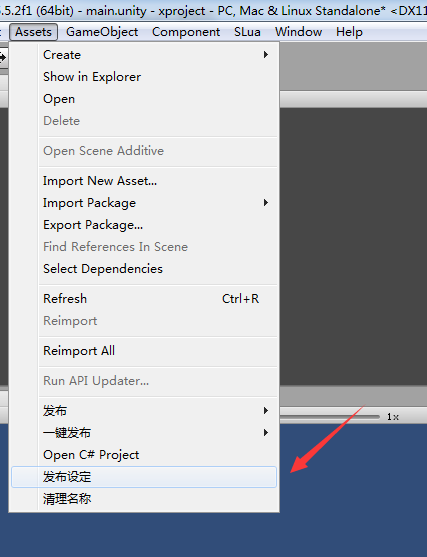
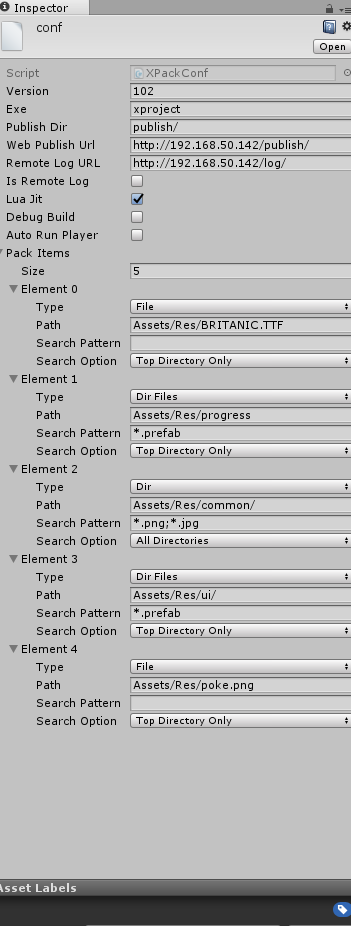
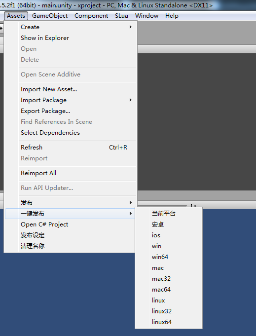

##XProject解决什么问题？

XProject解决**打包**，**网络更新/切换版本**，**统一装载流程**，**部署版本** 的一套方案框架。

如果你需要一套能热更使用lua的unity的简要框架，并且已经解决了发布时候将要解决的乱七八糟的事情，这就是你要的。

XProject屏蔽编辑器和各个版本差异的装载，开发期直接使用装载编辑资源，运行期会使用bundle
比较典型的一个函数搞定的方式如下

XDesc desc = XLoad.load( string res, Type tp, Action<XDesc> complete )
( 参考以前Resource.Load--就是他的异步变种版 )

接口定义成 即可以XDesc可以协程， 也可以使用complete完成可以回调

资源XAssetInfo内存中只有一份，不用时候可以用unload进行卸载（可以配合缓存XPoolManager清理！）

当XBundleInfo的资源没有hold住XAssetInfo的时候。会根据时间unload包

XProject使slua, unity5.5.2f1 其他版本请自行转换

直接可以将publish目录拷贝至http完成部署，客户端根据ver.json配置更新到任意版本

##使用约定

所有可更新资源放置于Assets/Res下

Lua位于Assets/../lua目录，在打包时，会对应拷贝或生成至Assets/Res目录下

XLoading管理进度条，默认会有Assets/Res/progress/style1.prefab 资源基础进度条

UIRoot为根名，必须拥有 back底层 window窗口层 msgbox弹框层 progress进度条

##LUAJIT

使用luajit2.1beta3 **解决全平台luajit字节码生成问题**，生成执行源码在build目录下

文件夹jit目录有build生成的平台文件，如果OSX没有执行权限报错，请cd jit目录 chmod -R 777 *

##打包部分

代码存在于Plagins/XPack/Editor目录

点击发布设定

 
##配置说明
**Version**，表示本次打包使用版本号。在运行时用于对比客户端和远程上使用版本是否一致（通过对应平台目录下ver.json和本地
version.json进行比较），如果不同则启动更新程序比较当前客户端启动下载列表更新到此版本。
**Exe**, 表示生成exe名称
**PublishDir**, 发布程序对应的相对工程目录
**Web Publish Url** 表示将在远程部署中使用的远程地址XConf.publishUrl一般一致，这里会自动填上下载包地址，后期需要修改ab包下载地址的话也可执行修改。
**Remote Log Url** 和 **isRemoteLog** 更新时候会修改对应的XConf配置，是否会将日志发往远程（解决手机上不好看日志的问题）
**LuaJit** 是否使用字节码生成

**Debug Build** 是否debug 编译
**Auto Run Player**

**PackItems** 确定要装载打包的数据
只关注需要直接访问的，至于需要优化，需要自己设置AssetBundle
现在有3种打包方式
File 按文件打包 – 打包单个文件
Dir 将整个目录中的文件打包
DirFiles 将目录中类型文件单个打包

 
使用一键发布即可发布

##服务端部署

服务端部署根据WebPublishUrl填的名称，将真个publish展开拷贝，部署在对应的服务端，可以根据平台下面的ver.json随意切换版本。
客户端使用版本

一些固定参数：
    
    public class XConf
    {
    // 强制装载AB，该参数只在编辑器状态有用
    public static bool forceLoadAB = true;
    // 远程更新地址
    public static string publishUrl = "http://192.168.50.142/publish/";
    // 开启更新
    public static bool isUpdateVersion = true;
    
    // luastart函数
    public static string luastart = "Main";
    
    // 以下会根据 versionUrl + ver.json 更新
    // 远程日志端口 
    public static string remoteLogUrl = "http://192.168.50.142/log/";
    // 是否发送远程远程日志
    public static bool isRemoteLog = false;
    }

客户端读次配置进行更新（编辑状态有一些方便的更改）
forceLoadAB，默认情况下装载直接同步装载资源，如果该参数标志为true，需要有资源，打包后使用。
则进行装载pc的包异步进行测试，该步骤可用于模拟测试手机上的情况

## 参考

luajit2.1 beta3 http://luajit.org/download.html

slua https://github.com/pangweiwei/slua

slua ldb https://github.com/jiangzhhhh/ldb

